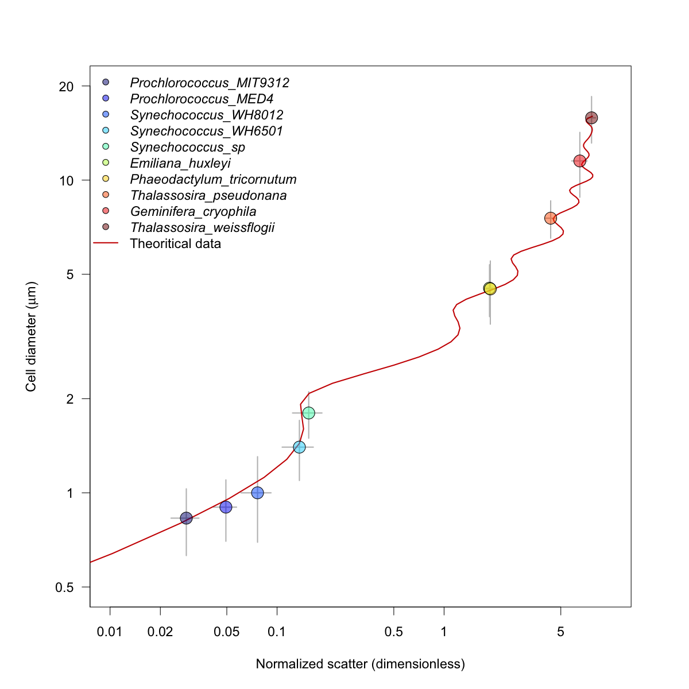

# Calibration light scattering - cell diameter
The goal of the experiment was to calibrate light scattering measured by our SeaFlow instrument into cell diameter measured by Coulter Coulter using phytoplankton cultures of various shapes and sizes.
We used cultures grown under continuous light and monitored the cultures daily to ensure cells were growing exponentially at the start of the experiments.
The light scattering property of each cell (alive, not fixed), normalized by 1 micron beads, was measured by SeaFlow. The same sample was analyzed by Coulter Counter.

***François Ribalet, Megan Schatz and Jarred Swalwell contributed to this project.***
