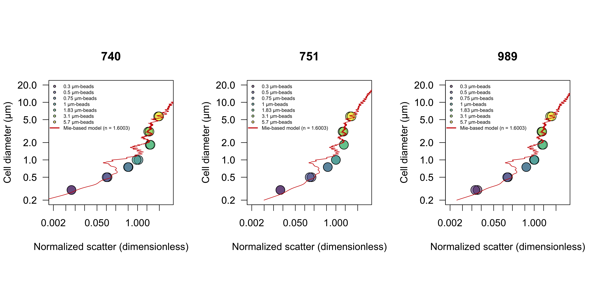
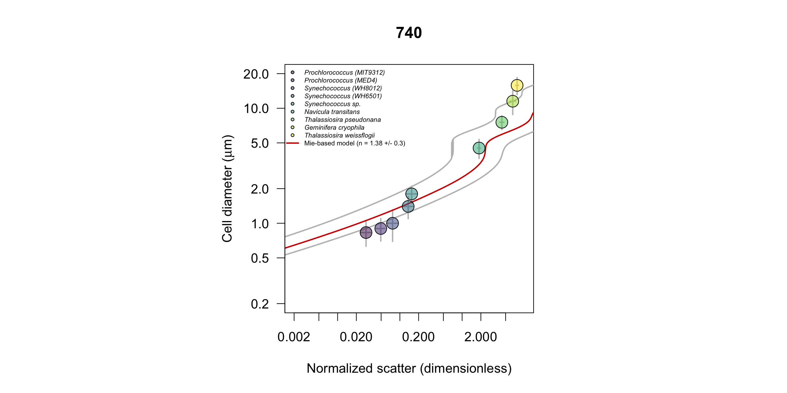

# Calibration light scattering - cell diameter
The goal of this project was to infer diameter of individual particles from SeaFlow-based light scatter measurements by the application of Mie light scatter theory to a simplified optical model. Since the optical geometry of the SeaFlow is complicated by scatter occurring within the sample stream, an optimization procedure was used to minimize differences between the measured forward scatter and the scatter intensity predicted by Mie light scatter of homogeneous spherical particles. The optimization was performed using SeaFlow-based scattering measurements of polystyrene calibration beads of known refractive index (1.603) and diameter (0.3, 0.5, 0.75, 1, 1.83, 3.1 and 5.7 µm). Mie-predicted bead diameters were in good agreement with reference diameters, indicating that the optimized Mie theory accurately reproduce the scatter intensity measured by the instrument.

A lookup table of theory-based solutions for particle forward scattering was created over a range of particle diameter detectable by the SeaFlow (0.3 - 5 µm) and indices of refraction (1.35, 1.38 and 1.41) that cover the range applicable to marine phytoplankton (Lehmuskero et al. 2018). To evaluate the applicability of these solutions, we compared Mie-predicted cell diameter to observations of 9 phytoplankton cultures using Coulter Counter. The Mie-predicted cell diameter using the mid-range index of refraction (1.38) was in good agreement with observations.

***François Ribalet, Megan Schatz and Jarred Swalwell contributed to this project.***
