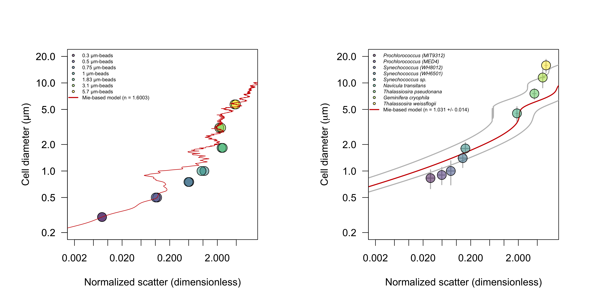

# Calibration light scattering - cell diameter
The goal of this project was to infer particle cell size from forward scatter measurements. The cell diameter of individual cells was estimated from SeaFlow-based light scatter within the context of Mie light scatter theory. Since the optical geometry of the SeaFlow is not precisely known, an optimization procedure was used to minimize differences between the measurement-derived forward scatter and those predicted by Mie light scatter theory. The optimized Mie theory was applied to SeaFlow-based scattering measurements of polystyrene calibration beads of known refractive index (1.6003) and diameter (0.3, 0.5, 0.75, 1, 1.83, 3.1 and 5.7 µm). Theoretical and measured forward scatter was similar for all except the 0.75-µm beads (left panel).

Using this optimization, a lookup table of theory-based solutions for particle forward scattering was created over a range of particle diameter detectable by the SeaFlow (0.3 - 10 µm) and indices of refraction (1.35, 1.38 and 1.41) that cover the range applicable to marine phytoplankton (Lehmuskero et al. 2018). To evaluate the applicability of these solutions, we compared Mie-predicted cell diameter to observations of 9 phytoplankton cultures using Coulter Counter. The Mie-predicted cell diameter using the mid-range index of refraction (1.38) was in good agreement with observations (R2 = 0.90, p < 0.0001). Discrepancies were observed for the diameter of the larger phytoplankton (<i>Geminifera cryophila</i> and <i>Thalassiosira weissflogii</i>) and the smaller cyanobacteria (<i>Prochlorocococcus</i> MIT9312 and MED4 and <i>Synechococcus</i> WH8012), which, for larger phytoplankton, may be related to inappropriate approximation of the spherical shape of particles used in the Mie theory (Quirantes and Bernard, 2004), while for small cyanobacteria, direct measurements of cell diameter were less reliable as they were near the detection limit of  the Coulter Counter Multisizer.

***François Ribalet, Megan Schatz and Jarred Swalwell contributed to this project.***
